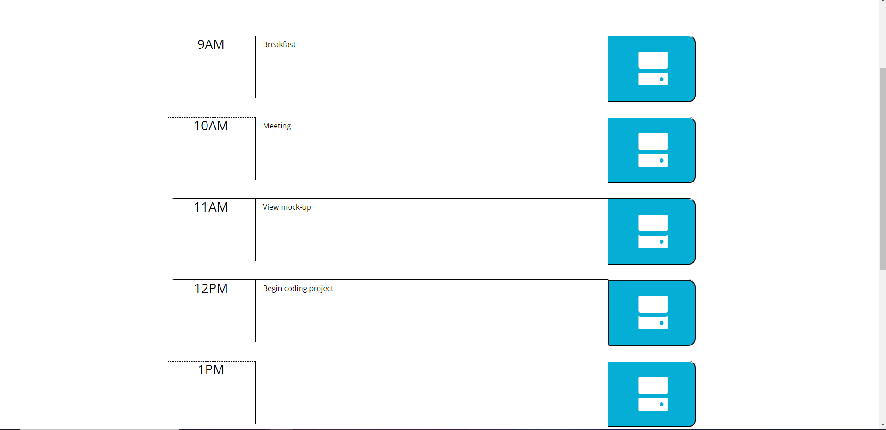

# Work Day Scheduler Starter Code

##Intent

Work day scheduler is an app designed to plan out your everyday work schedule! This application gives the current date and will allow you to know when your time frame for your schedule has passed, present, or is coming up.

# Built With 

*HTML

*CSS

*JS

# Credits 

Ben Martin (Tutor)

Ocean Veliz (Classmate)

https://www.youtube.com/watch?v=LvIt1GuS_DI&t=933s

# Example of what to expect

## Link to Website

